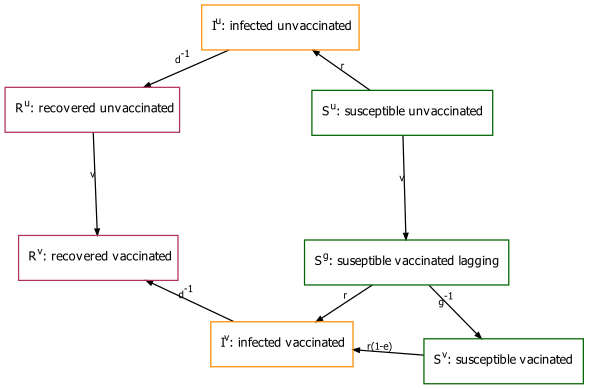

```{r, include = FALSE}
knitr::opts_chunk$set(
  collapse = TRUE,
  comment = "#>"
)
```

```{r setup, echo = FALSE}
```

## Compartments



$g$ --- vaccination lag period.\
$e$ --- vaccine effectiveness.\
$v$ --- vaccination rate.\
$r$ --- infection rate.\

## Equations

$$
\begin{aligned}
\frac{dS^u}{dt} &= -vS^u-rS^u\\
\frac{dS^g}{dt} &= +vS^u-rS^g-g^{-1}S^g\\
\frac{dS^v}{dt} &= +g^{-1}S^g-r(1-e)S^v\\
\frac{dI^u}{dt} &= +rS^u-d^{-1}I^u\\
\frac{dI^v}{dt} &= +rS^g+r(1-e)S^v-d^{-1}I^v\\
\frac{dR^u}{dt} &= +d^{-1}I^u-vR^u\\
\frac{dR^v}{dt} &= +d^{-1}I^v+vR^u\\
\end{aligned}
$$
