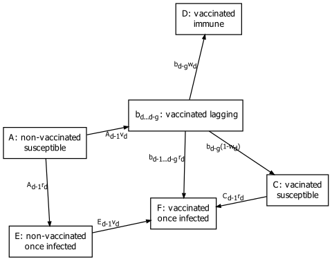

```{r, include = FALSE}
knitr::opts_chunk$set(
  collapse = TRUE,
  comment = "#>"
)
```

```{r setup, include=FALSE}
```

## Compartments



$d$ --- day index.\
$g$ --- vaccination lag period (given).\
$w_d$ --- vaccine effectiveness on day $d$ (given).\
$v_d$ --- vaccine coverage on day $d$.\
$r_d$ --- flu incidence on day $d$.\
$b_d$ --- number of vaccinations of susceptible on day $d$.\

## Calculations

$d=0$ --- initial conditions.\
$d=1$ --- first timepoint (day) for which we have data.\
$N$ --- starting population size (given).\
$V_d$ --- vaccinations on day $d$ (given).\
$s_d^*$ --- infections on day $d$ in absence of vaccination (given).\
$P_d^*$ --- susceptible population on day $d$ in absence of vaccination.\
$s_d^a$ --- averted infections on day $d$.\
$s_d$ --- infections on day $d$.\

For $d=0$:

$A_0 = N$\
$b_0 = 0$\
$C_0 = 0$\
$D_0 = 0$\
$E_0 = 0$\
$F_0 = 0$\
$P_0^* = N$\
$s_0 = 0$\
$s_0^a = 0$\

For $d>0$ (order presented corresponds to the order of calculations):

1. $r_d = \frac{s_d^*}{P_{d-1}^*}$\
2. $s_d=r_dA_{d-1} + r_dC_{d-1} + r_db_{d-1...d-g}$\
3. $P_d^* = P_{d-1}^* - s_d^*$\
4. $s_d^a = s_d^* - s_d$\
5. $v_d = \frac{V_d}{A_{d-1}+E_{d-1}}$\
6. $b_d=v_dA_{d-1}$\
7. $A_d = A_{d-1} - r_dA_{d-1}-b_d$\
8. $b_{d-1} ... b_{d-g}=b_{d-1} ... b_{d-g} - r_db_{d-1} ... b_{d-g}$\
9. $C_d = C_{d-1} - r_dC_d + b_{d-g} - w_db_{d-g}$\
10. $D_d = D_{d-1} + w_db_{d-g}$\
11. $E_d=E_{d-1} + r_dA_{d-1} - v_dE_{d-1}$\
12. $F_d=F_{d-1} + r_dC_{d-1} + r_db_{d-1} ... b_{d-g} + v_dE_{d-1}$\

Line $b_{d-1} ... b_{d-g}$ means that the same calculation is done on each $b_{d-i}$ from $i=1$ to $i=g$. The calculation being (in line 8) $b_{d-i}=b_{d-i}-r_db_{d-i}$.
